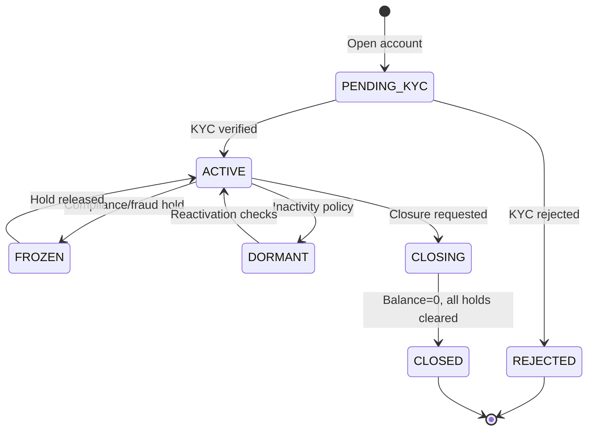
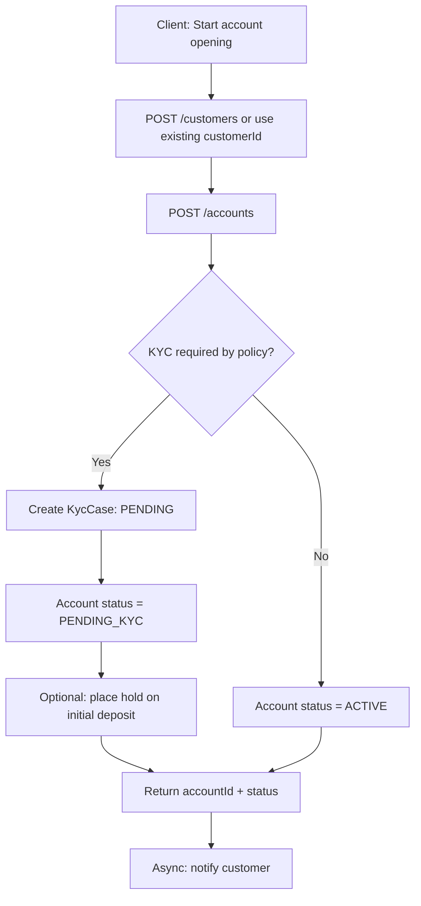
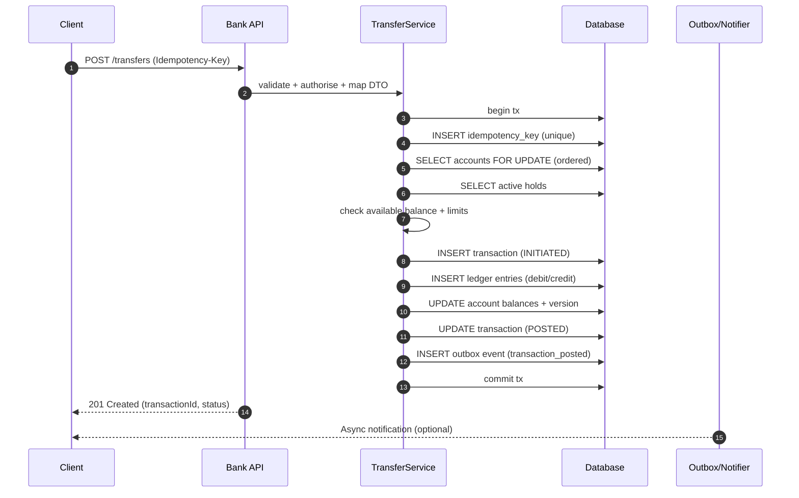

Account Opening 

Good. Since **user service is already done**, the next step is to treat **bank account** as a **separate domain** from user.

Do **not** mix everything into `User`.
A user is a person.
An account is a banking product owned by that person.

---

# 1) First understand the domain clearly

For a basic bank application, these are different things:

## User

Represents the customer.

Example:

* id
* name
* email
* phone
* dob

## Account

Represents bank account opened by the user.

Example:

* accountId
* accountNumber
* accountType
* balance
* status
* branchCode
* createdAt
* userId

## Transaction

Represents money movement.

Example:

* transactionId
* accountId
* type
* amount
* description
* timestamp
* availableBalanceAfterTransaction

---

# 2) Real idea: one user can have many accounts

### Relationship

* **One User -> Many Accounts**
* **One Account -> Many Transactions**

So your entity relation is mostly:

* `User 1 --- * Account`
* `Account 1 --- * Transaction`

---

# 3) Flow of account opening

This is the main thing you asked.

## Account opening flow

### Step 1: User exists

Before opening account, first check:

* does this user exist?
* is user eligible to open account?

For now, simple check:

* user id present in DB

### Step 2: Request comes for account opening

Frontend / Postman sends request like:

```json
{
  "userId": 1,
  "accountType": "SAVINGS",
  "initialDeposit": 5000,
  "branchCode": "MUM001"
}
```

### Step 3: Backend validates request

Check:

* user exists
* accountType valid
* initialDeposit not negative
* maybe minimum balance rules

Example:

* savings minimum deposit = 1000
* current minimum deposit = 5000

### Step 4: Generate account number

System generates unique bank account number.

Example:

* `202600001234`
* or random 12-digit
* or branch + sequence

### Step 5: Create account

Create account row with:

* generated account number
* account type
* opening balance = initial deposit
* status = ACTIVE
* linked user

### Step 6: Store opening transaction

If initial deposit > 0, create first transaction:

* type = CREDIT
* amount = initialDeposit
* description = "Initial deposit during account opening"

### Step 7: Return response

Response should contain:

* account id
* account number
* account type
* balance
* status
* owner name

---

# 4) Main backend flow in simple words

## Request flow

```text
Client
 -> AccountController
 -> AccountService
 -> UserRepository (check user)
 -> AccountRepository (save account)
 -> TransactionRepository (save opening transaction)
 -> Response DTO
```

---

# 5) What modules you should create now

Since user service is already done, create these next:

## Must-have

* `Account` entity
* `AccountRepository`
* `AccountService`
* `AccountController`
* `AccountOpenRequestDto`
* `AccountResponseDto`

## After that

* `Transaction` entity
* `TransactionRepository`
* `TransactionService`

---

# 6) Suggested entity design

## User entity

You probably already have this.

```java
User
- id
- name
- email
- ...
```

## Account entity

Important fields:

```java
Account
- id
- accountNumber
- accountType        // SAVINGS, CURRENT
- balance
- status             // ACTIVE, CLOSED, BLOCKED
- branchCode
- openedAt
- user
```

### Why this matters

Because account must store:

* who owns it
* what type it is
* how much balance it has
* whether it is active or closed

---

# 7) Account statuses you should keep

Use enum.

## Example

* `PENDING`
* `ACTIVE`
* `BLOCKED`
* `CLOSED`

For now, when account is opened:

* set status = `ACTIVE`

Later these statuses help in:

* withdraw only from ACTIVE accounts
* block suspicious account
* reject operations on CLOSED account

---

# 8) Account types you should keep

Use enum.

## Example

* `SAVINGS`
* `CURRENT`
* `FIXED_DEPOSIT` later maybe

For now keep only:

* `SAVINGS`
* `CURRENT`

That is enough.

---

# 9) DTOs you should design

## Account opening request DTO

```java
public class AccountOpenRequestDto {
    private Long userId;
    private String accountType;
    private BigDecimal initialDeposit;
    private String branchCode;
}
```

## Account response DTO

```java
public class AccountResponseDto {
    private Long accountId;
    private String accountNumber;
    private String accountType;
    private BigDecimal balance;
    private String status;
    private String branchCode;
    private Long userId;
    private String userName;
}
```

---

# 10) Service logic for account opening

This is the heart.

## `openAccount()` flow

### Step-by-step

1. Fetch user by `userId`
2. If user not found -> throw exception
3. Validate account type
4. Validate initial deposit
5. Generate unique account number
6. Create account object
7. Set default values
8. Save account
9. Create opening transaction if deposit > 0
10. Return response DTO

---

# 11) Pseudo-logic

```text
openAccount(dto):
    user = find user by dto.userId
    if user not found -> exception

    validate accountType
    validate initialDeposit

    accountNumber = generateUniqueAccountNumber()

    account = new Account()
    account.user = user
    account.accountNumber = accountNumber
    account.accountType = dto.accountType
    account.balance = dto.initialDeposit
    account.status = ACTIVE
    account.branchCode = dto.branchCode
    account.openedAt = now()

    savedAccount = save(account)

    if initialDeposit > 0:
        create transaction for opening deposit

    return mapToResponse(savedAccount)
```

---

# 12) Important business rules

You asked how the flow should be. This is where real logic comes.

## For savings account

Possible rules:

* minimum opening deposit = 1000
* account can be opened by normal users

## For current account

Possible rules:

* minimum opening deposit = 5000
* maybe business user in future

## Common rules

* one user can open multiple accounts
* account number must be unique
* initial deposit cannot be negative
* balance cannot be null
* closed account cannot be used for transactions

---

# 13) How account number should be generated

This is important.

## Bad way

* manually enter account number from frontend

Why bad?

* duplicate risk
* user should not control it

## Better way

Generate in backend

### Simple version

Use random 10–12 digit number.

### Better version

Use:

* branch code
* year
* sequence number

Example:

```text
MUM001-2026-00001
```

or numeric:

```text
202600000001
```

### Important

Always keep:

* `unique = true`

---

# 14) Recommended account opening API

## Endpoint

```http
POST /accounts/open
```

## Request body

```json
{
  "userId": 1,
  "accountType": "SAVINGS",
  "initialDeposit": 5000,
  "branchCode": "MUM001"
}
```

## Response

```json
{
  "accountId": 10,
  "accountNumber": "202600001234",
  "accountType": "SAVINGS",
  "balance": 5000,
  "status": "ACTIVE",
  "branchCode": "MUM001",
  "userId": 1,
  "userName": "Pravin"
}
```

---

# 15) After account opening, what flows come next

Once account is created, then your next services should be:

## Core services

* open account
* get account by id
* get account by account number
* get all accounts of a user
* deposit money
* withdraw money
* transfer money
* close account
* get account balance
* get account statement

---

# 16) Correct development order for you

Since you said no security now, this is the best order:

## Phase 1

* User module done
* Account opening
* Get account details
* Get all user accounts

## Phase 2

* Deposit
* Withdraw
* Balance check

## Phase 3

* Transfer between accounts
* Transaction history
* Monthly statement

## Phase 4

* Account close/block/freeze
* validations and exception handling
* pagination for statements

---

# 17) Very important design decision

Do not keep only `balance` logic without `transaction` records.

Because in banking:

* balance tells current money
* transaction history tells **why** balance changed

So every deposit/withdraw/transfer should create a transaction entry.

Example:

* open account with 5000 -> credit transaction
* deposit 2000 -> credit transaction
* withdraw 1000 -> debit transaction

---

# 18) Transaction types you will need later

Use enum.

* `CREDIT`
* `DEBIT`
* `TRANSFER_IN`
* `TRANSFER_OUT`
* `ACCOUNT_OPENING`

For now even this is enough:

* `CREDIT`
* `DEBIT`

---

# 19) Database table idea

## users

* id
* name
* email
* ...

## accounts

* id
* account_number
* account_type
* balance
* status
* branch_code
* opened_at
* user_id

## transactions

* id
* account_id
* type
* amount
* description
* transaction_time

---

# 20) Real-world flow example

Let us say:

User:

* id = 1
* name = Pravin

Request:

```json
{
  "userId": 1,
  "accountType": "SAVINGS",
  "initialDeposit": 3000,
  "branchCode": "PUNE001"
}
```

## Backend does:

1. finds user 1
2. validates SAVINGS
3. checks 3000 >= minimum deposit
4. generates account number
5. creates account with balance 3000
6. saves opening transaction
7. returns account info

Now account is ready.

Later when user deposits 2000:

* balance becomes 5000
* one CREDIT transaction stored

Later when withdraws 1000:

* balance becomes 4000
* one DEBIT transaction stored

---

# 21) Common mistakes beginners make here

Avoid these:

## Mistake 1

Putting account fields inside `User`

Wrong:

```java
User {
   name;
   email;
   accountNumber;
   balance;
}
```

Why wrong?
Because one user may have many accounts.

---

## Mistake 2

Not creating transaction table

Then later you cannot show:

* mini statement
* passbook
* transfer history

---

## Mistake 3

Using `double` for money

Use:

```java
BigDecimal
```

Why?
Because money needs precision.

---

## Mistake 4

Taking account number from frontend

Always generate in backend.

---

## Mistake 5

Not using enums for account type/status

String typos create bugs.

Example:

* `"saving"`
* `"savings"`
* `"SAVINGS"`

Enum solves this.

---

# 22) Best clean architecture for your case

## Controller

Only handles request and response.

## Service

Contains business rules.

## Repository

Only DB work.

## DTO

Used for input/output.

## Entity

Represents database table.

This is exactly how your current layered architecture should grow.

---

# 23) What should happen when user opens account?

Here is the final clean flow:

```text
1. User registers
2. User exists in system
3. User submits account opening request
4. Backend validates request
5. Backend generates unique account number
6. Account is created and linked to user
7. Initial balance is stored
8. Opening transaction is stored
9. Account becomes ACTIVE
10. Response returned to client
```

---

# 24) My recommendation for your project now

Build these **3 account APIs first**:

## APIs to build now

1. `POST /accounts/open`
2. `GET /accounts/{accountId}`
3. `GET /accounts/user/{userId}`

Then build:
4. `POST /accounts/deposit`
5. `POST /accounts/withdraw`

This order will make your project feel real very quickly.

---

# 25) Final structure you should aim for

```text
controller
- UserController
- AccountController
- TransactionController

service
- UserService
- AccountService
- TransactionService

repository
- UserRepository
- AccountRepository
- TransactionRepository

dto
- AccountOpenRequestDto
- AccountResponseDto
- DepositRequestDto
- WithdrawRequestDto
- TransactionResponseDto

entity
- User
- Account
- Transaction

enums
- AccountType
- AccountStatus
- TransactionType
```

---

# 26) What I want you to do next

Implement in this exact order:

## Step 1

Create `Account` entity with relation to `User`

## Step 2

Create `AccountOpenRequestDto`

## Step 3

Create `AccountRepository`

## Step 4

Create `openAccount()` in service

## Step 5

Create `POST /accounts/open`

## Step 6

Test in Postman

---

# 27) One strong industry-level note

In real banking systems:

* account opening is not just one insert
* it may involve KYC, approval, nominee, branch verification, risk flags

But for your project, keep it simple:

**User -> Open Account -> Initial Deposit -> Transaction Record**

That is enough and correct.

---

If you want, next I’ll give you the **exact entity + DTO + service flow structure for Account module in Java Spring Boot**, without security, in a clean interview-quality design.


# vau-bank-application-backend


# Designing and Implementing Application Logic for a Java-Based Bank Server

## Executive summary

This report proposes a rigorous, implementation-oriented design for a Java-based bank server built with a layered architecture (Entity → DTO → Service → Controller → Repository). The design focuses on correctness under concurrency, financial-grade traceability, and security-by-default. It treats the database as the system of record for money movement and uses ACID transactions, explicit locking for balance-affecting operations, and end-to-end auditability to reduce the risk of inconsistent balances and irreconcilable transaction histories. PostgreSQL’s transaction isolation model and row-level locking semantics are used as the concrete reference point for concurrency behaviour, because it clearly documents isolation levels and `SELECT … FOR UPDATE` locking. citeturn2search0turn2search1

Security requirements are framed around: (a) entity["organization","OWASP","appsec nonprofit"] API-centric risks (especially broken object-level authorisation and mass assignment/excessive data exposure patterns), citeturn0search4turn6search3turn7search19 (b) OAuth 2.0 / OpenID Connect token-based resource protection with modern best-current-practice guidance, citeturn1search0turn8search0turn6search1 and (c) consistent, machine-readable error responses using the current IETF standard for “Problem Details”, so clients can reliably interpret failures. citeturn7search0turn7search4

From a banking-standards perspective, the proposed domain model and API boundary are designed to remain compatible with widely-used financial messaging concepts and to leave room for ISO-20022-aligned integrations (e.g., external payment rails) later. citeturn3search0turn3search5 For KYC/AML, the report adopts internationally recognised baseline expectations from entity["organization","FATF","aml/cft standards body"] Recommendations (Customer Due Diligence, record keeping), while explicitly treating jurisdiction-specific rules as configuration and policy modules rather than hard-coded logic. citeturn1search3turn1search7

A four-week (one-month) execution plan is provided with weekly milestones, deliverables, effort estimates, and risk mitigations. The plan is sequenced to deliver a thin vertical slice early (account opening + KYC state + read-only APIs), then harden the money-motion core (ledger-backed posting with locking + idempotency), and finally add operational readiness (auditing, statements, scheduled payments, observability, backups, load testing). Spring’s documented transaction semantics and method-level security are used as reference patterns for service boundaries and authorisation enforcement points. citeturn5search16turn6search2turn9search12

## Product scope and required banking features

A “bank server” can mean anything from a demo ledger to a production-grade core banking component. This report assumes a pragmatic middle ground: a deposit-account subsystem that supports internal transfers and is extensible to external payments later. ISO 20022 is used as the reference family for interoperable financial messaging concepts, without assuming that ISO 20022 messages are directly exposed on your REST API. citeturn3search0turn3search5

### Core features and user stories

**Account opening and KYC**
- As a customer, I can open an account and receive an account identifier/number.
- As a customer, I can submit identity and address information and supporting documents (KYC) for verification.
- As an operations user, I can review/approve/reject a KYC case, and the account becomes active only when policy requirements are satisfied. These expectations align with FATF’s Customer Due Diligence emphasis and record keeping as baseline AML/CFT controls. citeturn1search3turn1search7

**Account types**
- As a customer, I can open a current account or savings account; optionally a term deposit account with restricted withdrawals.
- As the bank, I can configure fees and interest rules based on product type.

**Deposits, withdrawals, transfers**
- As a customer, I can deposit funds (cash/branch simulation or internal credit), withdraw funds (subject to available balance), and transfer funds to another internal account.
- As the system, I must prevent double-spends and inconsistent balances under concurrent requests, using isolation + locks + idempotency. PostgreSQL documents both isolation levels and row-level locking via `FOR UPDATE`, which are directly relevant to these invariants. citeturn2search0turn2search1

**Balance inquiry and statements**
- As a customer, I can view current balance and available balance.
- As a customer, I can request a statement for a date range and get a stable, reproducible view.

**Holds**
- As the bank, I can place holds (e.g., AML review, disputed transaction, manual operations hold) that reduce available balance but do not change the posted/ledger balance.

**Fees and interest**
- As the bank, I can apply fees (monthly maintenance, transfer fees), and compute/post interest accrual according to product rules.

**Scheduled payments**
- As a customer, I can schedule recurring transfers (internal standing orders) with predictable behaviour and idempotent execution.

**Closures**
- As a customer, I can request closure, after which the account is not usable for new debits; the bank can finalise closure once balances reach zero and obligations are settled.

**Notifications**
- As a customer, I receive notifications (transaction posted, low balance, KYC status, scheduled payment executed/failed).

**Audit**
- As the bank, I can produce an audit trail of security-sensitive events, configuration changes, and money movements, consistent with secure logging guidance (event capture, integrity, and operational usefulness). citeturn4search2turn4search11

## Domain model and DTO designs

### Design principles for a bank domain model

The model should explicitly separate:
- **Identity/security principal** (“User” for authentication/authorisation and roles) from
- **Customer identity** (“Customer” + KYC evidence), and from
- **Financial state** (Accounts, Holds, Transactions, Ledger Entries).

This separation supports least privilege and avoids leaking identity fields through account APIs—an issue directly tied to API excessive data exposure / broken object property level authorisation risks. citeturn7search19turn7search3

### Entity model proposal and relationships

A minimal but extensible relational model:

- **User** (authentication principal)
    - `id (UUID)`, `username/email (unique)`, `passwordHash`, `status`, `roles`, `createdAt`, `lastLoginAt`
    - Password storage should follow modern guidance (slow hashes such as bcrypt/Argon2, salts, and defensive measures), consistent with entity["organization","OWASP","appsec nonprofit"] guidance. citeturn4search0

- **Customer**
    - `id`, optional `userId` (for retail customers), `customerType` (INDIVIDUAL/BUSINESS), `legalName`, `dob`, `contact`, `riskRating`, `createdAt`
    - **Constraints:** for INDIVIDUAL, require DOB and legal name; for BUSINESS, require registration data (policy module).

- **KycCase** / **KycDocument**
    - `KycCase(id, customerId, status, submittedAt, decidedAt, decidedByUserId, decisionReason)`
    - `KycDocument(id, kycCaseId, type, issuerCountry, documentNumber, expiryDate, fileRef, checksum)`
    - FATF’s baseline expectations motivate modelling CDD and retention as first-class rather than ad hoc. citeturn1search3

- **Account**
    - `id`, `accountNumber (unique)`, `currency`, `accountType`, `status`, `openedAt`, `closedAt`
    - `ledgerBalanceMinor`, `availableBalanceMinor`, `overdraftLimitMinor`, `version`
    - **Concurrency control:** `version` enables optimistic locking for non-balance updates and can cooperate with JPA’s `@Version` mechanism. citeturn2search2turn2search3

- **AccountHolder** (join table)
    - Supports joint accounts and delegated access (e.g., spouse, business signatories).
    - `accountId`, `customerId`, `role` (PRIMARY, JOINT, VIEW_ONLY), `createdAt`

- **Hold**
    - `id`, `accountId`, `amountMinor`, `reasonCode`, `status`, `placedAt`, `expiresAt`, `releasedAt`
    - Holds reduce **available** balance; they are critical to model explicitly (not as implicit flags).

- **Transaction** (logical operation)
    - `id`, `type`, `status`, `currency`, `amountMinor`, `fromAccountId`, `toAccountId`, `reference`, `requestedByUserId`, `idempotencyKey`, timestamps
    - Transaction status is separate from Account status.

- **LedgerEntry** (posting lines)
    - `id`, `transactionId`, `accountId`, `direction (DEBIT/CREDIT)`, `amountMinor`, `balanceAfterMinor`, `postedAt`
    - This supports a ledger-backed design where balances are derived from postings; even if you store balances for performance, ledger entries remain the audit-grade ground truth.

- **ScheduledPayment**
    - `id`, `fromAccountId`, `toAccountId` (internal MVP), `amountMinor`, `currency`, `scheduleExpression`, `status`, `nextRunAt`, `lastRunAt`, `failureCount`

- **Notification**
    - `id`, `customerId`, `channel`, `template`, `payload`, `status`, timestamps

- **AuditEvent**
    - `id`, `actorUserId`, `action`, `entityType`, `entityId`, `occurredAt`, `ip`, `userAgent`, `correlationId`, `beforeJson`, `afterJson`
    - Security logging should focus on integrity, completeness, and operational usefulness; OWASP and NIST offer practical guidance on what and how to log. citeturn4search2turn4search11

### Account type comparison table

| Account type | Intended use | Interest behaviour | Withdrawal/transfer rules | Typical fees | Special constraints |
|---|---|---|---|---|---|
| Current (chequing) | Daily payments, salary | Usually none or low | Unlimited internal transfers; overdraft optional | Maintenance fee possible | Optional overdraft limit; strong fraud monitoring |
| Savings | Accumulation, low churn | Interest accrues and posts periodically | Transfers allowed; may limit withdrawals by policy | Lower fees | Interest plan required; may enforce minimum balance |
| Term deposit (fixed) | Locked savings | Fixed/known interest | No withdrawals until maturity except penalty | Early withdrawal penalty | Maturity date, breakage rules, penalty fee schedule |
| Business current | Payments for businesses | Typically none | Transfers allowed; multiple signatories | Higher fees | Multi-user authorisation model, limits, approvals |

Interest/fees are product-policy-driven; modelling them explicitly enables transparent recomputation and auditability.

### DTO strategy and constraints

DTOs should be explicit, not “entity-shaped”, to reduce:
- mass assignment risk (client populating fields it should not control), and
- excessive data exposure (server returning sensitive fields by default). Both issues are highlighted in OWASP’s API Top 10 (including object property-level authorisation concerns). citeturn7search19turn7search3

Use Jakarta Bean Validation for DTO validation (e.g., `@NotNull`, `@Size`, `@Pattern`, `@Positive`) at controller boundaries and optionally at service boundaries for defence-in-depth. citeturn5search2turn5search18

Recommended DTOs (illustrative):
- `OpenAccountRequest { customerId?, accountType, currency, initialDeposit? }`
- `KycSubmissionRequest { customerId, identityFields, documents[] }`
- `TransferRequest { fromAccountId, toAccountId, amount, currency, reference }`
- `AccountResponse { accountId, accountNumberMasked, type, status, currency, ledgerBalance, availableBalance }`
- `TransactionResponse { transactionId, status, postedAt, entriesSummary }`

For money, avoid floating point; represent in minor units (`long`) or use a dedicated money type and explicit rounding rules. JSR-354 (Java Money) exists to standardise money/currency handling and rounding models, even if you ultimately persist minor units. citeturn5search19turn5search15

## Service-layer workflows and state machines

### Account lifecycle state machine

A controlled workflow reduces “impossible states” and clarifies which actions are valid at each stage.



This is compatible with FATF-driven gating: accounts should not be fully operational until identity verification requirements are met, with jurisdiction-specific policy determining exactly what “verified enough” means. citeturn1search3

### Account opening flow

Key design choice: make account opening **idempotent** and **auditable**, with explicit KYC gating. If you allow an initial deposit before KYC completes, treat it as posted but unavailable (held) until verification—otherwise you risk funds availability issues and customer confusion.



### Transfer workflow

Transfers are the hardest “core banking” operation in your list because they involve:
- preventing double-spend under concurrent debits,
- consistent posting to two accounts,
- idempotency (clients retry),
- auditability and notifications.

A robust approach is “create a logical Transaction, then post LedgerEntries atomically in one DB transaction”.



This flow aligns with ACID expectations: one atomic unit of work updates all relevant rows, and row locks prevent interleaving debits that would violate invariants. PostgreSQL’s documentation of `FOR UPDATE` is a clear basis for the lock semantics used here. citeturn2search1

## Transaction management, concurrency control, and idempotency

### ACID and isolation levels in practice

Balance-affecting operations should be executed inside a single database transaction, using Spring’s declarative transaction management to define boundaries at the service layer. Spring documents `@Transactional` behaviour, rollback rules, and propagation options; use that to keep controllers thin and ensure invariants live in services. citeturn5search16turn5search0

Isolation and anomalies:
- The SQL standard defines isolation levels, and PostgreSQL documents the phenomena and its interpretation of serialisability. citeturn2search0
- Read Committed is widely used but requires careful locking for correctness when multiple concurrent transactions update shared state. citeturn2search0turn2search1

**Recommendation for an MVP with correctness focus**
- Use **READ COMMITTED** (or your DB default) plus explicit row locks (`SELECT … FOR UPDATE`) when checking and updating balances.
- Consider **SERIALIZABLE** only for limited high-risk operations if you have strong retry logic and have profiled contention, because serialisable transactions can abort under conflict and require retries. PostgreSQL defines serialisability in terms of equivalence to some serial order. citeturn2search0

### Optimistic vs pessimistic locking

**Optimistic locking**
- Suitable for low-contention updates (profile edits, address updates, notification preferences).
- JPA supports optimistic concurrency via `@Version`, where the persistence provider manages a version attribute automatically. citeturn2search2turn2search3

**Pessimistic locking**
- Suitable for high-risk money movement where you must prevent lost updates and negative balances.
- Use row-level locks for the account rows being debited/credited. PostgreSQL explicitly documents `SELECT … FOR UPDATE` as preventing concurrent modification until the transaction ends. citeturn2search1

**Deadlock avoidance**
- Always lock accounts in a deterministic order (e.g., lexicographically by account UUID) for transfers so two concurrent transfers don’t lock A then B vs B then A.

### Idempotency strategy (client retries)

HTTP defines idempotent methods at the protocol semantics level (e.g., GET/PUT/DELETE are intended to be idempotent), but POST is not inherently idempotent. citeturn1search2 For banking, clients will retry POST requests due to timeouts and transient failures, so **application-level idempotency** is essential.

There is an active standardisation effort at entity["organization","IETF","internet standards body"] for an `Idempotency-Key` header for non-idempotent methods like POST/PATCH, specifically to make such requests fault-tolerant. citeturn7search2turn7search6

**Practical design**
- Require `Idempotency-Key` for: transfers, deposits, withdrawals, scheduled payment creation, account closure request.
- Persist `(principalId, endpoint, idempotencyKey)` with:
    - request hash (to detect key reuse with different payload),
    - resulting resource id (e.g., transactionId),
    - response snapshot (status + body), and
    - TTL/expiry policy.
- Enforce uniqueness with a DB unique constraint; on conflict, return the stored response.

This prevents double charges and aligns behaviour with the goals of the evolving header standard. citeturn7search2

## Repository patterns and database schema

### Repository and persistence patterns

With a layered architecture, treat repositories as persistence adapters, not business logic containers:
- Repositories expose *intentional* queries (e.g., `findAccountForUpdate(accountId)`) rather than generic “find by everything”.
- Service layer enforces invariants and orchestrates multi-repository transactions.

For locking, prefer explicit repository methods that clearly indicate locking intent. If you use JPA, ensure locking aligns with provider semantics (`@Version` for optimistic; explicit lock queries for pessimistic), as documented in Jakarta EE/Hibernate references. citeturn2search2turn2search3

### Suggested relational schema and constraints

Below is a schema-oriented inventory (not full DDL) to guide migrations and indexing.

| Table | Purpose | Key columns | Constraints & indexes (examples) |
|---|---|---|---|
| `users` | Auth principals | `id`, `email`, `password_hash`, `status` | `UNIQUE(email)`; index on `status` |
| `customers` | Customer identity | `id`, `user_id`, `type`, `legal_name` | `UNIQUE(user_id)` (optional); index on `type` |
| `kyc_cases` | KYC workflow | `id`, `customer_id`, `status`, `submitted_at` | FK `customer_id`; index `(customer_id, status)` |
| `kyc_documents` | KYC evidence | `id`, `kyc_case_id`, `type`, `file_ref` | FK; index on `kyc_case_id` |
| `accounts` | Deposit accounts | `id`, `account_number`, `type`, `currency`, `status`, `ledger_balance_minor`, `available_balance_minor`, `version` | `UNIQUE(account_number)`; index `(customer_id, status)`; CHECK balances within range |
| `account_holders` | Joint holders | `account_id`, `customer_id`, `role` | composite PK; indexes on `customer_id` |
| `holds` | Balance holds | `id`, `account_id`, `amount_minor`, `status` | index `(account_id, status)`; CHECK `amount_minor > 0` |
| `transactions` | Logical ops | `id`, `type`, `status`, `currency`, `amount_minor`, `from_account_id`, `to_account_id`, `idempotency_key` | index on `(from_account_id, created_at)`; unique on `(requested_by, idempotency_key)` |
| `ledger_entries` | Posting lines | `id`, `transaction_id`, `account_id`, `direction`, `amount_minor`, `balance_after_minor` | index `(account_id, posted_at)`; FK `transaction_id` |
| `scheduled_payments` | Standing orders | `id`, `from_account_id`, `to_account_id`, `amount_minor`, `next_run_at`, `status` | index `(status, next_run_at)` |
| `notifications` | Outbound messages | `id`, `customer_id`, `channel`, `status` | index `(status, created_at)` |
| `audit_events` | Audit trail | `id`, `actor_user_id`, `action`, `entity_type`, `occurred_at` | index `(occurred_at)`; index `(entity_type, entity_id)` |
| `idempotency_keys` | Retry safety | `id`, `principal_id`, `key`, `request_hash`, `resource_id`, `created_at`, `expires_at` | `UNIQUE(principal_id, key, endpoint)` |
| `outbox_events` | Reliable async | `id`, `event_type`, `payload`, `status`, `created_at` | index `(status, created_at)` |

**Why these indexes matter**
- `ledger_entries(account_id, posted_at)` is essential because statements and transaction history are typically “by account and time”.
- For holds, `(account_id, status)` is vital because available balance calculation repeatedly sums active holds.

**DB integrity checks**
- Use CHECK constraints for positive amounts (`amount_minor > 0`), currency code length, and enumerated statuses (or DB enums).
- Enforce referential integrity with FKs (e.g., ledger entry requires an existing transaction).
- For internal transfers, enforce “two-sided posting” at the application level (and optionally via triggers or a reconciliation job).

## REST API design, security, validation, and auditability

### REST API surface (versioned)

The API should be described in an OpenAPI document so you can generate clients, contract tests, and documentation; the OpenAPI Specification is explicitly designed as a language-agnostic interface contract for HTTP APIs. citeturn3search18turn3search6

| Method | Endpoint | Purpose | AuthZ (example) | Idempotent? | Notable errors |
|---|---|---|---|---|---|
| POST | `/api/v1/customers` | Create customer profile | `ROLE_CUSTOMER` (self) / `ROLE_ADMIN` | Yes (keyed) | 400, 409 |
| POST | `/api/v1/kyc/cases` | Submit KYC | Customer owns customerId | Yes (keyed) | 400, 403 |
| PATCH | `/api/v1/kyc/cases/{id}/decision` | Approve/reject KYC | `ROLE_COMPLIANCE` | Yes (keyed) | 403, 409 |
| POST | `/api/v1/accounts` | Open account | Customer | Yes (keyed) | 400, 409 |
| GET | `/api/v1/accounts/{id}` | Account details | Object-level auth | N/A | 403, 404 |
| GET | `/api/v1/accounts/{id}/balance` | Ledger + available balance | Object-level auth | N/A | 403, 404 |
| POST | `/api/v1/deposits` | Deposit (internal/admin channel) | `ROLE_TELLER` / admin | Yes (keyed) | 400, 409 |
| POST | `/api/v1/withdrawals` | Withdraw (internal/admin channel) | `ROLE_TELLER` / admin | Yes (keyed) | 400, 409, 422 |
| POST | `/api/v1/transfers` | Internal transfer | Customer | Yes (keyed) | 400, 403, 409, 422 |
| GET | `/api/v1/transactions/{id}` | Transaction lookup | Object-level auth | N/A | 403, 404 |
| GET | `/api/v1/accounts/{id}/statements` | List statements | Object-level auth | N/A | 403 |
| POST | `/api/v1/accounts/{id}/closure-requests` | Request closure | Customer | Yes (keyed) | 409, 422 |

**Object-level authorisation is non-negotiable.** entity["organization","OWASP","appsec nonprofit"] highlights broken object-level authorisation (BOLA) as a top API risk: attackers manipulate object identifiers to access data they should not. citeturn6search3turn0search4

### Error responses: Problem Details (RFC 9457)

Standardise error bodies using “Problem Details for HTTP APIs” (RFC 9457), which obsoletes RFC 7807 and defines a structured, machine-readable payload for errors. citeturn7search0turn7search4

Suggested mapping:
- `400 Bad Request`: DTO validation failed; include field errors in extensions.
- `401 Unauthorized`: missing/invalid token.
- `403 Forbidden`: authenticated but not allowed (role/object-level).
- `404 Not Found`: resource does not exist *or* deliberately not disclosed (security choice).
- `409 Conflict`: idempotency key reuse mismatch; optimistic lock conflict.
- `422 Unprocessable Content`: business rule failure (insufficient funds, account not active, currency mismatch).

### Authentication and authorisation

**Transport security**
- Require TLS; TLS 1.3 is defined in RFC 8446 and is designed to prevent eavesdropping and tampering. citeturn3search3

**Token-based API protection**
- Use OAuth 2.0 (RFC 6749) as the general authorisation framework. citeturn1search0
- Implement the API as an OAuth 2.0 Resource Server that validates bearer tokens, aligning with documented Spring Security guidance for JWT resource servers. citeturn0search6turn0search2
- For authentication on top of OAuth 2.0, support OpenID Connect Core (identity layer over OAuth 2.0). citeturn6search1

**Modern OAuth security posture**
- Apply “Best Current Practice for OAuth 2.0 Security” (RFC 9700), which updates earlier threat guidance and deprecates less secure modes. citeturn8search0
- Use PKCE (RFC 7636) for public clients to mitigate authorisation code interception. citeturn8search1
- Support token revocation where applicable (RFC 7009), especially for logout and incident response. citeturn8search2

**JWT correctness**
- JWT is defined in RFC 7519. citeturn1search1
- Apply JWT Best Current Practices (RFC 8725) because “JWT done wrong” becomes an authentication-bypass class vulnerability. citeturn6search0
- Follow defensive implementation guidance (e.g., algorithm whitelisting, validating `iss/aud/exp`, avoiding insecure defaults) such as OWASP’s JWT guidance for Java. citeturn4search5

**Role-based and object-level access**
- Use method-level security in services (not just controllers) so business logic cannot be invoked without checks; Spring Security recommends `@PreAuthorize`-style controls over legacy annotation approaches. citeturn6search2turn6search6
- Combine:
    - **RBAC** for coarse rules (customer vs teller vs compliance),
    - **resource ownership checks** (account/customer belongs to principal),
    - **field-level DTO shaping** to prevent object property-level authorisation failures. citeturn7search19turn7search3

### Validation and business rule enforcement

Use a layered validation strategy:
- **Request validation (DTO-level)** with Jakarta Bean Validation for structural correctness (required fields, formats, ranges). citeturn5search2turn5search18
- **Domain validation (service-level)** for business rules:
    - account status must be ACTIVE for debits,
    - currency must match account currency,
    - available balance must cover debit amount + fees,
    - scheduled payments must not exceed configured limits,
    - closure requires ledger balance = 0 and no active holds.

### Logging, audit trails, and compliance posture

Treat audit as a product feature:
- Security logging should capture authentication/authorisation outcomes, privilege changes, money movement, and configuration edits. OWASP provides developer-focused security logging guidance. citeturn4search2
- entity["organization","NIST","us standards institute"] SP 800-92 provides enterprise log management guidance (collection, analysis, retention, operational management), which is directly relevant for audits and incident response. citeturn4search11turn4search3

Recommended audit properties:
- Every posted transaction produces an immutable audit event, referencing transactionId, actor, channel, and correlationId.
- Audit data is append-only (no destructive updates); if edits are required, emit compensating events.
- Extend logs with trace/correlation IDs for incident reconstruction.

## Testing strategy, deployment, and infrastructure considerations

### Testing pyramid tailored to banking invariants

**Unit testing (fast)**
- Domain rules: available balance calculation, hold application/release, fee rounding rules, idempotency key semantics.
- State machine transitions: invalid transitions rejected (e.g., CLOSED account cannot be reactivated).

**Integration testing (real DB)**
- Use a real database in tests (e.g., PostgreSQL) to validate isolation/locking behaviour, since concurrency anomalies often do not reproduce in in-memory DBs.
- Write “race tests”: two concurrent transfers debiting the same account must never allow negative available balance.

**Contract testing**
- Generate OpenAPI from code or code from OpenAPI, and run consumer-driven contract tests. OpenAPI is intended to enable this kind of tooling ecosystem. citeturn3search18turn3search6

**Load and resilience testing**
- Run load tests for transfers and statement retrieval; focus on P95 latency and deadlock/timeout rates.
- Validate that idempotency prevents double-posting under retry storms.

### Deployment and operations

**Observability**
- Use Spring Boot Actuator for health and metrics endpoints; Spring explicitly positions Actuator as “production-ready features” including health and metrics. citeturn9search12turn9search0
- Adopt OpenTelemetry for correlating traces/metrics/logs across requests; the OpenTelemetry spec defines foundational concepts and signal correlations. citeturn9search7turn9search3

**Backups and recovery**
- Plan for backups from day one. PostgreSQL documents `pg_basebackup` for online base backups of a running cluster, usable for point-in-time recovery workflows. citeturn9search1
- Test restores regularly; treat restore as a required drill, not an optional checklist item.

**Migrations**
- Use a schema migration tool (e.g., Flyway) and adopt disciplined migration patterns. Flyway documentation explains repeatable migrations and execution ordering, which helps structure schema evolution. citeturn9search2turn9search10

**Scalability**
- Keep the API layer stateless; scale horizontally.
- Expect the database to be the first scaling constraint; design indexes and queries for account-history workloads.
- For write-heavy transfer workloads, reduce lock contention through:
    - minimal locked scope,
    - deterministic lock ordering,
    - short transactions,
    - avoiding remote calls inside DB transactions.

## One-month execution timeline, milestones, and risk mitigation

The timeline below assumes a single engineer (you) implementing a high-quality MVP in four weeks. If you have more engineers, the same work can be parallelised, but the sequencing still matters (money-motion core must be stabilised before adding “nice-to-have” features).

### Weekly milestones and deliverables

| Week | Milestone focus | Deliverables | Effort estimate | Key risks addressed |
|---|---|---|---|---|
| Discovery and foundations | Requirements, domain boundaries, security model, data design | Architecture doc; domain model + ERD; OpenAPI draft; migration skeleton; project scaffolding; CI pipeline baseline | 4–6 person-days | Prevents rework; ensures API + schema compatibility early |
| Identity, KYC, account lifecycle | Customers/Users, KYC workflow, account opening, read APIs | User/Customer/KYC entities + repos; account open API; account status transitions; object-level authorisation checks; baseline audit events; integration tests for workflows | 5–7 person-days | Eliminates “ungated” account activation; reduces BOLA risk via early object-level auth citeturn6search3 |
| Money movement core | Ledger, deposit/withdraw/transfer, holds, idempotency, locking | Transaction + ledger posting; available vs ledger balance; holds; idempotency key storage; pessimistic lock implementation; concurrency tests; error model using RFC 9457 | 6–8 person-days | Addresses double-spend risk; aligns with DB locking semantics citeturn2search1turn7search2 |
| Operational completeness | Statements, scheduled payments, notifications, monitoring, backups, hardening | Statement generation job + API; scheduled payments executor + idempotent runs; outbox-based notifications; Actuator endpoints; OpenTelemetry wiring; backup/runbook; load test report; security review checklist (OWASP ASVS) | 6–8 person-days | Ensures operability and audit readiness; strengthens logging citeturn4search2turn9search12 |

### Risk register and mitigations

| Risk | Why it matters | Likely week discovered | Mitigation |
|---|---|---|---|
| Concurrency bug allows negative balance | Financial correctness failure; hard to reconcile | Week 3 | Row locks for balance updates; deterministic lock ordering; race-condition integration tests; short transactions citeturn2search1 |
| Idempotency gaps cause duplicate transfers | Client retries become double-postings | Week 3 | Require idempotency key; unique constraint; store response snapshot; follow evolving IETF guidance citeturn7search2 |
| Broken object-level authorisation | Data breach / funds access by ID tampering | Week 2 | Enforce object-level checks at service layer; method security patterns; avoid entity-shaped DTOs citeturn6search3turn6search2 |
| Mass assignment / excessive data exposure | Sensitive data leakage or unauthorised field edits | Week 2 | Strict DTOs; allowlist mapping; output DTO shaping; OWASP API Top 10 alignment citeturn7search19turn7search3 |
| Token/JWT misconfiguration | Auth bypass / privilege escalation | Week 1–2 | Follow OAuth/JWT BCPs; validate issuer/audience/expiry; adopt RFC 9700 and RFC 8725 guidance citeturn8search0turn6search0 |
| Audit trail incomplete or mutable | Regulatory/audit failure; poor incident response | Week 2–4 | Append-only audit events; OWASP logging guidance; NIST log management practices citeturn4search2turn4search11 |
| Backup/restore not tested | Disaster recovery failure | Week 4 | Implement and rehearse restore; base backups approach documented by PostgreSQL citeturn9search1 |

### Concrete “definition of done” for the month

By the end of the month, an MVP can credibly be considered “bank-server-grade” (for a learning or internal prototype context) if:
- Transfers are atomic, idempotent, and concurrency-safe under load.
- Every transaction is traceable to ledger entries and audit events.
- KYC gating is enforced by the account lifecycle state machine.
- Security controls prevent BOLA/mass assignment patterns at the API boundary.
- Operational basics exist: monitoring endpoints, structured errors, backup runbook, and integration/load tests.

This definition aligns the project with the highest-risk categories first (money correctness + API security), reflecting both OWASP’s API risk prioritisation and the practical realities of building financial transaction systems. citeturn0search8turn6search3


Excellent—this is exactly how real backend systems are designed. Let’s treat this like a **production-grade banking system design document** (but simplified enough to implement step-by-step).

---

# 🏦 Bank Application – System Design Document

## 1. 🎯 Objective

Build a **secure, scalable banking system** that supports:

* Account management
* Transactions (deposit, withdraw, transfer)
* User authentication & authorization
* Transaction history
* Admin controls

---

## 2. 🧱 Core Functionalities

### 👤 User Module

* Register user
* Login (JWT-based)
* KYC verification (basic)

### 🏦 Account Module

* Create account (Savings/Current)
* View account details
* Check balance

### 💸 Transaction Module

* Deposit money
* Withdraw money
* Transfer money (Account → Account)
* View transaction history

### 🛡️ Security Module

* Authentication (Spring Security + JWT)
* Authorization (User/Admin roles)

### 🧑‍💼 Admin Module

* View all users
* Freeze/unfreeze account
* Monitor suspicious transactions

---

## 3. 🏗️ High-Level Architecture

```
Client (React / Postman)
        ↓
Controller Layer (REST APIs)
        ↓
Service Layer (Business Logic)
        ↓
Repository Layer (JPA / Hibernate)
        ↓
Database (MySQL/PostgreSQL)
```

---

## 4. 🔁 Data Flow (Critical – Interview Focus)

### 🔹 Example: Money Transfer Flow

```
1. User sends request (POST /transfer)
2. Controller validates request DTO
3. Service layer executes:
   - Check sender account exists
   - Check receiver account exists
   - Check balance
   - Deduct from sender
   - Add to receiver
   - Save transaction record
4. Transaction is wrapped in @Transactional
5. Response returned
```

### ⚠️ Important Concepts

* Use **ACID properties**
* Use **@Transactional** to avoid partial updates
* Prevent **race conditions** (locking if needed)

---

## 5. 🗃️ Database Design (Core Tables)

### 📌 User Table

| Field    | Type               |
| -------- | ------------------ |
| id       | Long               |
| name     | String             |
| email    | String             |
| password | String             |
| role     | ENUM (USER, ADMIN) |

---

### 📌 Account Table

| Field         | Type                    |
| ------------- | ----------------------- |
| id            | Long                    |
| accountNumber | String                  |
| type          | ENUM (SAVINGS, CURRENT) |
| balance       | Double                  |
| user_id       | FK                      |

---

### 📌 Transaction Table

| Field             | Type                               |
| ----------------- | ---------------------------------- |
| id                | Long                               |
| type              | ENUM (DEPOSIT, WITHDRAW, TRANSFER) |
| amount            | Double                             |
| timestamp         | LocalDateTime                      |
| senderAccountId   | FK                                 |
| receiverAccountId | FK                                 |

---

## 6. 🔌 API Design (REST Endpoints)

### 👤 Auth APIs

```
POST /auth/register
POST /auth/login
```

### 🏦 Account APIs

```
POST /accounts
GET /accounts/{id}
GET /accounts/balance/{id}
```

### 💸 Transaction APIs

```
POST /transactions/deposit
POST /transactions/withdraw
POST /transactions/transfer
GET /transactions/{accountId}
```

### 🧑‍💼 Admin APIs

```
GET /admin/users
PUT /admin/freeze/{accountId}
```

---

## 7. ⚙️ Internal Working (Important)

### 🔹 Transfer Logic (Service Layer)

```java
@Transactional
public void transfer(Long fromId, Long toId, double amount) {
    Account from = accountRepo.findById(fromId);
    Account to = accountRepo.findById(toId);

    if (from.getBalance() < amount) {
        throw new InsufficientBalanceException();
    }

    from.setBalance(from.getBalance() - amount);
    to.setBalance(to.getBalance() + amount);

    transactionRepo.save(new Transaction(...));
}
```

---

## 8. 🔐 Security Design

* Use **Spring Security**
* Password → BCrypt hash
* JWT Token flow:

```
Login → Generate Token → Client stores → Sends in header → Backend validates
```

---

## 9. ⚡ Edge Cases (VERY IMPORTANT)

* Double transaction issue (user clicks twice)
* Concurrent transfers
* Invalid account
* Negative balance
* System crash during transaction

👉 Solution:

* Use **@Transactional**
* Add **locking (Optimistic/Pessimistic)**
* Use **idempotency key** for APIs

---

## 10. 📈 Advanced (Company-Level Improvements)

### 🔹 Microservices Split

* User Service
* Account Service
* Transaction Service

### 🔹 Event-Driven (Kafka)

* Transaction → Event → Notification Service

### 🔹 Caching

* Redis for balance check

### 🔹 Monitoring

* Logs + ELK Stack

---

## 11. 🚀 Project Structure (Spring Boot)

```
com.bank.app
 ┣ controller
 ┣ service
 ┣ repository
 ┣ entity
 ┣ dto
 ┣ security
 ┣ exception
 ┗ config
```

---

## 12. 🔥 Real Industry Insights

* Banks **never directly update balance blindly**
* They maintain:

  * Ledger system
  * Audit logs
* Transactions are **immutable**

---

## 13. 💡 Next Step (Your Action)

I’ll guide you like real mentor.

### Step 1:

Start with:

* User + Account Entity

### Step 2:

Implement:

* Deposit & Withdraw (simple first)

### Step 3:

Then:

* Transfer (complex part)

---

## ❓ Quick Check (Answer This)

1. Why do we use `@Transactional` in transfer?
2. What happens if server crashes after deduct but before add?
3. How will you prevent duplicate transfer requests?

Reply with answers — I’ll evaluate like interviewer and push you to next level.
